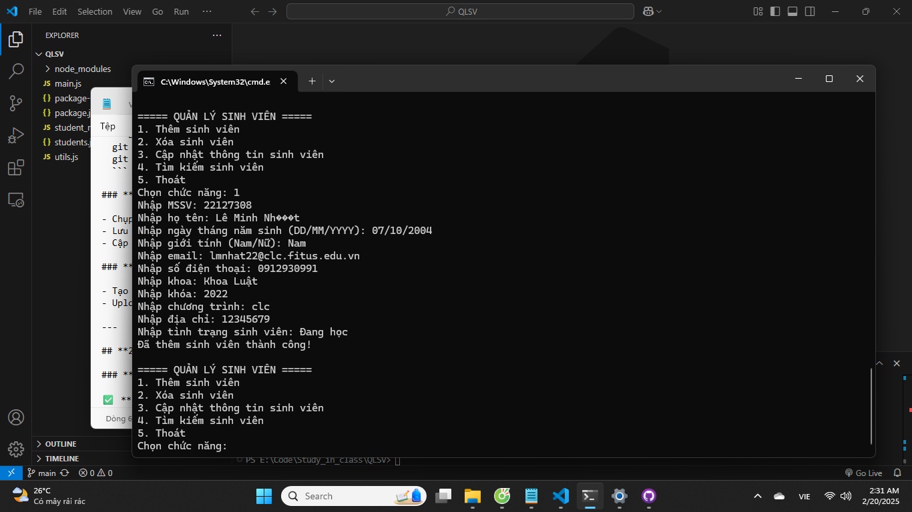
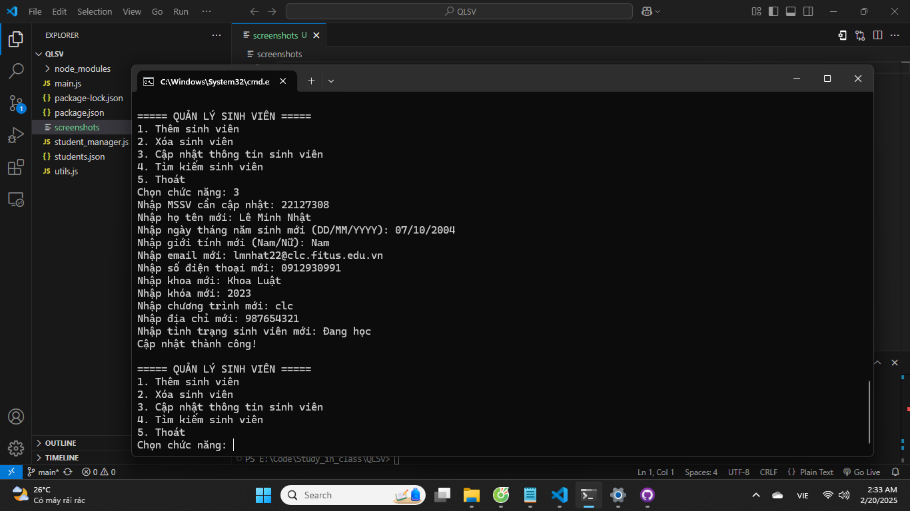
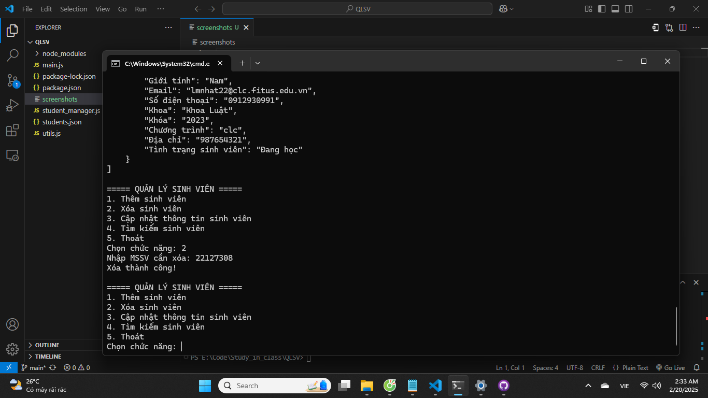

# Quản Lý Sinh Viên

## Giới Thiệu
Đây là một ứng dụng quản lý sinh viên sử dụng Node.js, cho phép người dùng thêm, cập nhật, tìm kiếm và xóa thông tin sinh viên. Dữ liệu sinh viên được lưu trữ trong file `students.json`.

## Chức Năng Chính
- **Thêm sinh viên**: Nhập thông tin sinh viên mới vào hệ thống.
  


- **Cập nhật sinh viên**: Chỉnh sửa thông tin sinh viên hiện có.



- **Tìm kiếm sinh viên**: Tìm kiếm sinh viên theo MSSV hoặc họ tên.


- **Xóa sinh viên**: Xóa một sinh viên khỏi hệ thống.



## Cấu Trúc Dữ Liệu Sinh Viên
Mỗi sinh viên có các thuộc tính sau:
- **MSSV**: Mã số sinh viên (duy nhất)
- **Họ tên**: Họ và tên đầy đủ
- **Ngày sinh**: Định dạng `DD/MM/YYYY`
- **Giới tính**: Nam/Nữ
- **Email**: Địa chỉ email hợp lệ
- **Số điện thoại**: 10 chữ số
- **Khoa**: Một trong các khoa hợp lệ (`Khoa Luật`, `Khoa Tiếng Anh thương mại`, `Khoa Tiếng Nhật`, `Khoa Tiếng Pháp`)
- **Khóa**: Số khóa học
- **Chương trình**: Tên chương trình đào tạo
- **Địa chỉ**: Địa chỉ cư trú
- **Tình trạng sinh viên**: Một trong các trạng thái hợp lệ (`Đang học`, `Đã tốt nghiệp`, `Đã thôi học`, `Tạm dừng học`)

## Cách Cài Đặt và Sử Dụng
### 1. Cài Đặt
Yêu cầu Node.js được cài đặt trên hệ thống.

```sh
npm install
```

### 2. Chạy Chương Trình
```sh
node student_manager.js
```

## Kiểm Tra Định Dạng Dữ Liệu
Dữ liệu nhập vào sẽ được kiểm tra tính hợp lệ:
- Email phải có định dạng hợp lệ.
- Số điện thoại phải có đúng 10 chữ số.
- Khoa và tình trạng sinh viên phải thuộc danh sách hợp lệ.

## Lưu Ý
- Đảm bảo file `students.json` tồn tại trước khi chạy chương trình. Nếu không, hệ thống sẽ tự tạo file mới.
- Khi nhập dữ liệu, hãy nhập đúng định dạng để tránh lỗi.

## Đóng Góp
Nếu bạn muốn đóng góp cải tiến hoặc sửa lỗi, vui lòng tạo pull request hoặc issue trên repository này.

## License
Dự án này được phát hành dưới giấy phép MIT.

